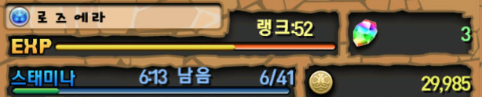
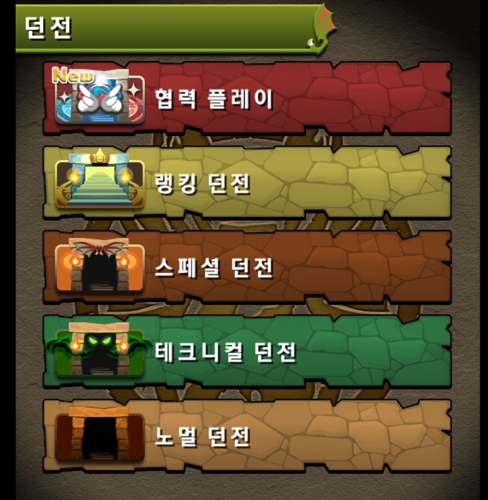

# Puzzel-and-Dragons
모바일계의 명실상부한 장수게임

## 1. 소개
일본 소프트뱅크의 자회사 GungHo에서 개발한 게임으로 2012년 2월 20일 처음 일본에서 출시된 match-3 방식의 퍼즐게임에 던전RPG 요소가 부가된 형식의 부분유료화 게임이다.

## 2. 게임 기본 요소
### 2.1. 유저

게임을 플레이하는 유저는 9개의 숫자로 이루어진 ID와 이름(닉네임), 랭크(레벨), 경험치, 스태미나, 마법석, 코인과 같은 정보를 갖는다.

- __ID__는 최초 계정 생성시 고유하게 주어지며, 게릴라 시간을 검색하거나 데이터 이전, 복구 등에 사용되므로 메모에 적어두거나 따로 저장해두는것이 좋다.

- __이름__은 영어, 한국어, 일본어, 한자, 특수문자 모두 사용 가능하며 언제든지 변경이 가능하고, 중복사용 또한 허용된다.

- __스태미나__의 경우 던전에 입장할 때 사용되는 자원으로 옛날같은 경우 1의 포인트가 회복되는데 10분이 걸렸던 반면, 최근에는 높은 포인트를 요구하는 던전의 증가와 유저 레벨이 높아짐으로서 5분마다 충전되도록 패치되었다. 랭크가 상승할 경우 스태미나가 전부 회복된다.

- __마법석__ 같은 경우 다른 게임에서의 캐쉬와 같은 개념으로, 스태미나를 회복, 몬스터Box 확장, 친구 최대수 증가, 레어 에그를 뽑는 일에 사용된다.

- __코인__은 몹을 강화, 진화 및 던전구입에 사용되며 플레이 초반을 제외하면 크게 신경쓰이지 않는 부분중에 하나이다. ~~허나 초반엔 가장 신경쓰이는 부분~~ 실상 던전 구매도 초기에는 존재하지 않았던 기능이었다.

- __랭크__같은 경우 상승마다 팀 코스트와 스태미나 최대치 상승이 번갈아가면서 이루어지며 구간에 따라 테크니컬 던전공개/팀 편성 수 상승/친구 최대수 증가/단짝 추가기능/선물기능 등이 사용 가능하게 된다.

### 2.2. 던전

이제는 다소 익숙한 개념이지만, 퍼즐앤드래곤에서는 던전에 입장하여 몬스터와 보스를 클리어하는 식으로 게임이 전개된다. 던전은 협력 플레이/랭킹 던전/스페셜 던전/테크니컬 던전/노멀 던전 등으로 나뉘며, 각 던전마다 특징을 가지고 있다.
- __노멀던전__ : 퍼즐앤드래곤의 가장 기본적인 형태의 던전.

- __테크니컬 던전__ : 랭크 10이 되면 최초로 공개되며, 노멀 던전에서 볼 수 없었던 종류의 몹이 등장하며 같은 스테미나를 요구하는 던전에 비해서 스텟량이 높고, 특히 대부분의 몹들이 고유한 '스킬'들을 사용한다.

- __스페셜 던전__ : 요일별 던전이나 콜라보레이션 던전, 챌린지 던전 등 특수한 기간에만 열리거나 이벤트로 진행되는 던전들은 전부 이 항목에서 등장한다.

- __랭킹 던전__ : 일정 기간에만 열리며, 남은 시간(300초)/평균 콤보/최대 데미지를 기준으로 던전 클리어 점수를 매겨 던전을 클리어한 유저들간의 랭킹을 확인해 볼 수 있다. 각 순위별로 얻게되는 보상이 다르다.

- __협력 플레이__ : 패치를 통해 추가된 기능으로, 기존에 존재했던 대부분의 던전을 말 그대로 다른 유저와의 '협럭'을 통해 공략할 수 있다(물론 난이도는 다르지만). 협력 플레이 방을 만들고, 공개된 방 ID를 공유받은 다른 유저가 접속하여 플레이하는 방식을 사용한다. 던전에서는 기본적으로 리더 캐릭터와 퍼즐 판을 공유한 상태에서 각자의 팀으로 번갈아가며 퍼즐을 굴리게 되며, 특수한 상황에서는 협력던전 고유의 규칙에 따른다.

### 2.3. 퍼즐맞추기

### 2.4. 파티구성

## 3. 몬스터
### 3.1.1. Hp,
### 3.1.2.
