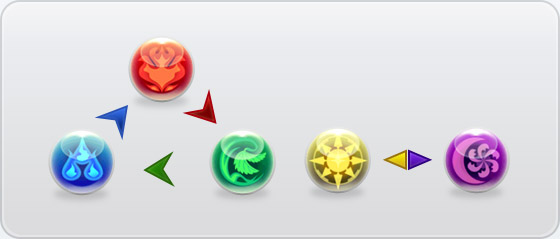
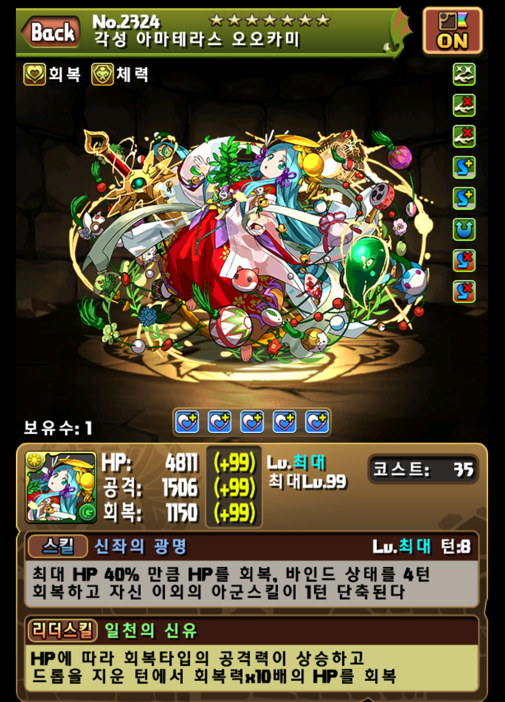
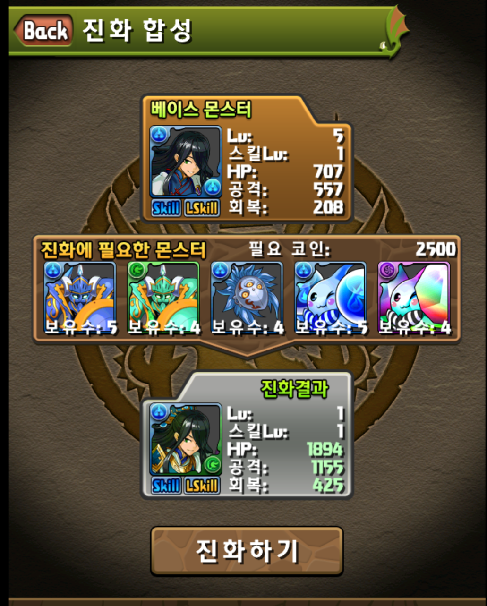
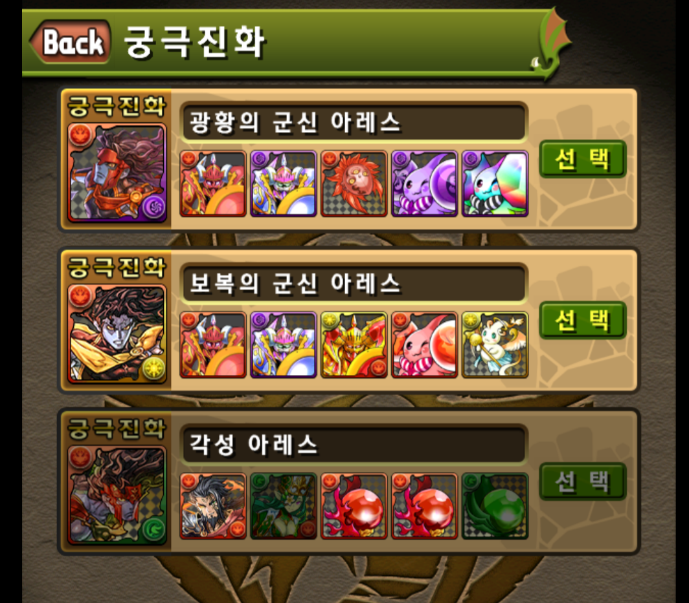
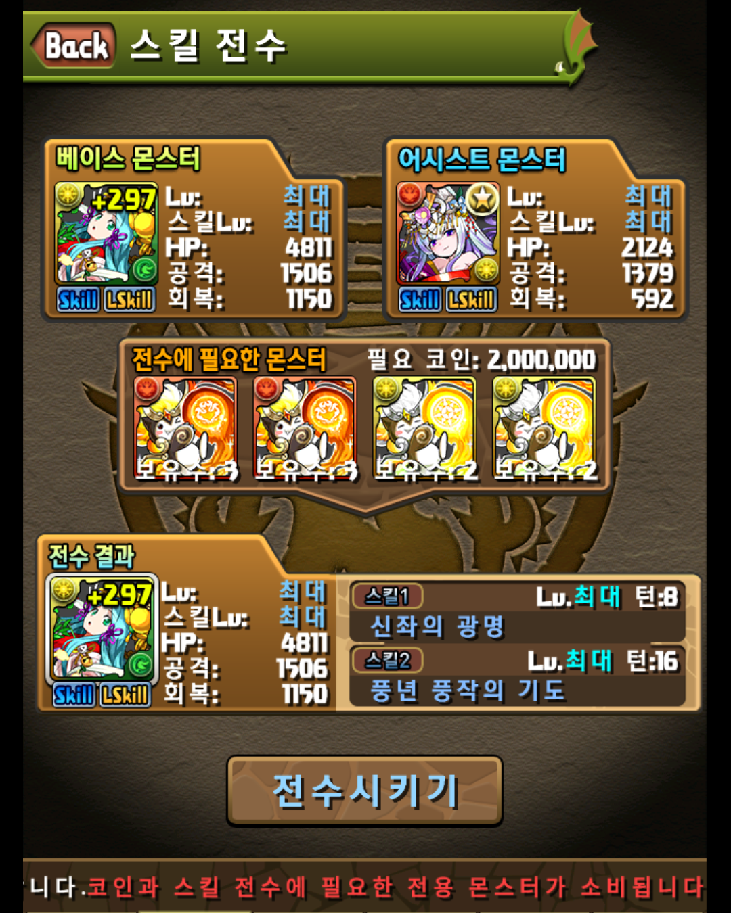

# Puzzel-and-Dragons
    모바일게임계의 유명인, 퍼즐계의 강자

~~메이저 게임은 오타쿠 게임이라고 못한다~~

## 1. 소개
일본 소프트뱅크의 자회사 GungHo에서 개발한 게임으로 2012년 2월 20일 처음 일본에서 출시된 match-3 방식의 퍼즐게임에 던전RPG 요소가 부가된 형식의 부분유료화 게임이다.
스토리는 전설의 드래곤을 찾는 모험이라는 심플한 주제를 가지고 있다. ~~허나 플레이하는 이들 아무도 신경쓰지 않는다~~

## 2. 게임 기본 요소
### 2.1. 유저

게임을 플레이하는 유저는 9개의 숫자로 이루어진 ID와 이름(닉네임), 랭크(레벨), 경험치, 스태미나, 마법석, 코인과 같은 정보를 갖는다.

- __ID__ 는 최초 계정 생성시 고유하게 주어지며, 게릴라 시간을 검색하거나 데이터 이전, 복구 등에 사용되므로 메모에 적어두거나 따로 저장해두는것이 좋다.

- __이름__ 은 영어, 한국어, 일본어, 한자, 특수문자 모두 사용 가능하며 언제든지 변경이 가능하고, 중복사용 또한 허용된다.

- __스태미나__ 의 경우 던전에 입장할 때 사용되는 자원으로 옛날같은 경우 1의 포인트가 회복되는데 10분이 걸렸던 반면, 최근에는 높은 포인트를 요구하는 던전의 증가와 유저 레벨이 높아짐으로서 5분마다 충전되도록 패치되었다. 랭크가 상승할 경우 스태미나가 전부 회복된다.

- __마법석__ 같은 경우 다른 게임에서의 캐쉬와 같은 개념으로, 스태미나를 회복, 몬스터Box 확장, 친구 최대수 증가, 레어 에그를 뽑는 일에 사용된다.

- __코인__ 은 몹을 강화, 진화 및 던전구입에 사용되며 플레이 초반을 제외하면 크게 신경쓰이지 않는 부분중에 하나이다. ~~허나 초반엔 가장 신경쓰이는 부분~~ 실상 던전 구매도 초기에는 존재하지 않았던 기능이었다.

- __랭크__ 같은 경우 상승마다 팀 코스트와 스태미나 최대치 상승이 번갈아가면서 이루어지며 구간에 따라 테크니컬 던전공개/팀 편성 수 상승/친구 최대수 증가/단짝 추가기능/선물기능 등이 사용 가능하게 된다.

### 2.2. 던전

이제는 다소 익숙한 개념이지만, 퍼즐앤드래곤에서는 던전에 입장하여 몬스터와 보스를 클리어하는 식으로 게임이 전개된다. 던전은 협력 플레이/랭킹 던전/스페셜 던전/테크니컬 던전/노멀 던전 등으로 나뉘며, 각 던전마다 특징을 가지고 있다.
- __노멀던전__ : 퍼즐앤드래곤의 가장 기본적인 형태의 던전.

- __테크니컬 던전__ : 랭크 10이 되면 최초로 공개되며, 노멀 던전에서 볼 수 없었던 종류의 몹이 등장하며 같은 스테미나를 요구하는 던전에 비해서 스텟량이 높고, 특히 대부분의 몹들이 고유한 '스킬'들을 사용한다.

- __스페셜 던전__ : 요일별 던전이나 콜라보레이션 던전, 챌린지 던전 등 특수한 기간에만 열리거나 이벤트로 진행되는 던전들은 전부 이 항목에서 등장한다.

- __랭킹 던전__ : 일정 기간에만 열리며, 남은 시간(300초)/평균 콤보/최대 데미지를 기준으로 던전 클리어 점수를 매겨 던전을 클리어한 유저들간의 랭킹을 확인해 볼 수 있다. 각 순위별로 얻게되는 보상이 다르다.

- __협력 플레이__ : 패치를 통해 추가된 기능으로, 기존에 존재했던 대부분의 던전을 말 그대로 다른 유저와의 '협럭'을 통해 공략할 수 있다(물론 난이도는 다르지만). 협력 플레이 방을 만들고, 공개된 방 ID를 공유받은 다른 유저가 접속하여 플레이하는 방식을 사용한다. 던전에서는 기본적으로 리더 캐릭터와 퍼즐 판을 공유한 상태에서 각자의 팀으로 번갈아가며 퍼즐을 굴리게 되며, 특수한 상황에서는 협력던전 고유의 규칙에 따른다.

### 2.3. 퍼즐(드랍)맞추기
퍼즐앤드래곤은 기본적으로 match-3 방식의 퍼즐게임 형식을 취하면서도 여러 변형점들을 추가하여 게임의 즐거움을 더하고 있다. 아래에는 이와 관련하여 게임상 혹은 유저들이 자주 언급하는 방식들을 간단히 나열해놓았다. 여기서 __드랍__(혹은 __드롭__)은 퍼즐앤드래곤에서 각각의 퍼즐을 표현할 때 쓰는 용어이다.

- 기본
 - 3개 연결
 - 5개 이상을 모아서 연결 - 몹 전체공격
 - 떨어진 드랍으로 연결 - 낙차
- 심화 : 해당 리더스킬 및 각성을 보유한 경우
 - 4개 연결 - 투웨이(Two-way)
 - 가로 한줄 동일색상 연결 - 횡강
 - 회복드랍을 십자로 연결
 - 주어진 속성드랍들로 공격 - 다속
 - 주어진 콤보 이상으로 공격
 - 강화된 드랍을 5개 이상 연결 - 드강

처음 보는 유저들은 언뜻 '이 게임 너무 어려운거 아냐?'라고 오해하기 쉽지만 상기에 나열된 모든 내용들이 던전 한번 도는데 고려해야 할 것이 아니라 내가 가지고 있는 몬스터와 상황에 맞춰 달리 적용되는 것이기 때문에 크게 걱정할 필요가 없다. 오히려 단순한 퍼즐맞추기가 아닌 파고들면 파고들수록 다양하고 깊이있는 플레이가 가능한 게임임을 알려준다고 보면 좋다.

이와 달리 퍼즐앤드래곤의 또다른 묘미라 할 수 있는 것이 바로 __속성__ 이다. 위 그림은 이 내용을 매우 간략하면서도 완벽하게 설명하고 있다.

퍼즐앤드래곤에는 기본적으로 불/물/나무/빛/어둠/회복 속성이 있으며 회복을 제외한 나머지 속성들은 각각 상성을 가지고 있다. 게임을 많이 플레이 해본 유저들이라면 친숙할텐데, 물은 불에 강하고 불은 나무에 강한, 화살표로 가르키는 속성은 가르켜지는 속성에 강하다. <U>강속성을 통한 공격은 몹에게 2배의 데미지</U>를 입히며 반대로 <U>약속성을 통한 공격은 데미지의 반만 적용</U>된다. 이외에는 정해진 데미지가 그대로 들어간다.

독특하게도 빛과 어둠속성은 서로에게 강속성 적용만 되고 약속성 적용은 없는 '약점없는 속성'이다. 때문에 그림에서도 화살표의 모양이 다르다. ~~버그없는 완벽한 그림 설명~~

### 2.4. 파티구성
퍼즐 맞추는 방식이 심화에서 다양하게 나열된 이유는 퍼즐앤드래곤의 파티 구성이 다양한 형태로 이루어지기 때문이다. 아래에서 설명하겠지만, 몬스터가 가지는 리더스킬이나 각성의 효과가 뛰어나기 때문에 조건에 맞추어 파티를 구성하는것은 매우 중요한 일이다.

작게는 던전 몬스터들의 HP와 방어력, 속성, 더 넓게는 적 몬스터의 스킬과 팀의 최대 HP, 회복력, __드롭력__ ,친구 ~~인맥과 지갑력~~ 등 다양한 요소가 고려되며 이에따라 다양한 파티가 편성된다.
~~그리고 초보는 팀코스트가 가장 중요하다~~

## 3. 몬스터

퍼즐앤드래곤을 매력적으로 만드는 가장 큰 요소는 바로 몬스터들이다. 몬스터들은 다양한 특징들을 가지고 있으며 이러한 특징들이 파티구성에 큰 영향을 미친다.
### 3.1. 스테이터스

#### 3.1.1. HP, 공격력, 회복력. 그리고 +
두말하면 잔소리겠지만, 몬스터들마다 고유한 수치값을 가지고 있다.

여기서 눈여겨볼 부분은 옆에 표시된 __+__ 부분인데, 이 부분이 바로 몹의 기본적은 스테이터스를 상승시키는 일종의 강화와 같다. 특정 확률로 인한 드랍이나 이벤트 등을 통해 +스텟이 붙은 몬스터들을 얻을 수 있으며, 이러한 몬스터들을 강화 합성을 통해 ~~갈아넣어서~~ 합성합으로서 +값들을 인계시킬 수 있다. 각각 +1마다 HP/공격/회복을 10/5/3 씩 증가시키며 최대값은 +99이다.

+강화를 위한 ~~노가다~~ 작업을 __쁠알작__ 이라고 부른다. 옛날같은 경우 모든 스텟에 +99강화를 한 몬스터를 가지는게 쉽지 않았으나 최근에는 '+에그 10배'가 적용된 던전이 열리거나 각종 이벤트(레어에그 기본 +30, +99, +297링 선물) 등으로 인해 어렵지 않게 볼 수 있게 되었다.

#### 3.1.2. 스킬과 리더스킬
__스킬__은 던전 내에서 특정 턴 수가 지나면 사용할 수 있는 액티브형 스킬로서 동일한 스킬을 가진 몬스터, 혹은 속성에 맞는 __삐__(호노피, 미즈피, 모쿠피, 히카피, 야미피)들을 강화 합성함으로서 상승시킬 수 있다. 전자는 확률적으로 상승하며 후자는 100% 상승한다.

__리더스킬__ 은 던전 내에서 항시 적용되는 패시브형 스킬로서 특정 조건(속성, 타입, HP, 맞춘 퍼즐의 수/모양/속성 등)을 만족시키면 만족하는 대상에 따라 효과를 부여한다. 이 효과는 몬스터를 반드시 __리더__ 로 선택했을 때만이 발동되며 따라서 팀 전체(5마리)에서 리더의 효과만이 유효하다. 친구, 혹은 모험가의 리더스킬 효과 또한 동일하게 적용된다.

참고로 스킬레벨을 최대로 올리기 위한 작업을 __스작__(스킬 레벨업 作)이라고 부른다.

#### 3.1.3. 각성과 잠재각성
각성은 화면 우측에 보이는 상자들로 각각의 고유한 효과들을 가지고 있다. 각성은 몬스터마다 가지고 있는 수와 종류가 다르며 같은 종류의 몹을 합성하거나 타마도라라는 몬스터를 합성함으로서 위에서 순서대로 획득할 수 있다.

여기서  이런 각성들이 위 퍼즐 맞추기의 심화에서 나온 '횡강'과 '투웨이'를 발동시키기 위한 조건이 된다.

잠재각성은 몬스터 일러스트 아래, 즉 화면 정중앙에 위치한 5개의 상자로서
- 일반 각성에서 얻을 수 없는 특수한 각성을 포함
- 모든 몬스터(강화합성 불가 몹 제외)가 가질 수 있음
- 몬스터마다 최대 5개까지 획득 가능
- 합성을 통한 타 몬스터에게 인계가 불가능
- 5개 이상 각성 시도 시 가장 오래된 각성이 사라짐

위와 같은 특징들을 가지고 있다.

잠재각성은 각 각성 별 잠재 타마도라를 합성함으로서 얻을 수 있으며 잠재 타마도라는 특정 던전에서 랜덤하게 난입하거나 포인트 상점에서 구매할 수 있다.

### 3.1.4. 타입
모든 몬스터는 하나 이상의 타입을 가지게 되는데 위 그림의 경우 몬스터 이름 아래에 표시된 '회복'과 '체력'이 그 예가 된다.

타입은 실상 '리더스킬'의 조건을 확인하는데 많이 사용된다. 예로 들어서 위 리더스킬 '일천의 신유'는 HP에 따라 '회복'타입의 공격력만이 상승하므로 파티 구성시 회복타입의 몬스터들을 넣어주는게 파티 공격력 상승에 도움이 된다.

### 3.1.5. 속성
몬스터들은 고유한 속성을 가지고 있으며, 몬스터 아이콘 좌상단에 표시되어있다. 만일 던전에서 목속성 드랍을 맞췄을 경우 목속성을 가지고 있는 몬스터만이 공격을 하게 된다. 즉, 파티를 전부 화속성으로 맞췄는데 매우 운이 안좋게도 화속성이 드랍이 나오지 않는다면 적 몬스터들을 공격할 방도가 없다! ~~스킬마저 턴이 부족하다면...~~

몇몇 몬스터들은 __서브속성__ 을 가지고 있는데 이는 이는 몬스터 아이콘의 우하단에 표시되는 속성으로서 해당 속성의 드롭을 맞췄을 시 절반의 공격력으로 공격하게 된다. 즉 주속성과 서브속성 모두 빛속성을 가지고 있는 몬스터로 공격을 할 때 주속성 공격이 100의 데미지가 떴다면 서브속성으로 50의 공격이 개별적으로 들어가게 된다. 적의 방어도가 20이었다면 (100-20)+(50-20)=110 만큼의 데미지가 적용되는 셈.

### 3.1.6. 포인트
던전을 클리어하거나 팀을 편성할 당시에는 전혀 고려되지 않는 ~~심지어 보이지도 않는~~ 사항임에도 불구하고 모든 몬스터들이 고유하게 가지고 있으며 때론 중요시하게 언급도 되는 부분이 바로 포인트이다. 이 포인트라는 부분은 게임 초기에는 존재하지 않았던 부분으로 오직 '몬스터 구입'이라는 기능을 위하여 만들어진 부분이다.

가방의 크기제한으로 인하여 가질 수 있는 몬스터의 수가 한정되어 있는 상황에서 다른 사람은 몰라도 그 유저에게는 쓸모없는 몬스터를 얻게 되었다면 예전의 경우 눈물을 머금고 판매하거나 ~~오지않을~~ 먼 미래를 바라보며 창고(Box) 구석에 고이 모셔두는 수밖에 없었는데 몬스터를 판매할 때 금화뿐만 아니라 __포인트__ 또한 정산되고, 이 포인트를 __몬스터 구입__ 이라는 '포인트 상점'에서 소모할 수 있게 함으로서 몬스터를 떠나보내는 아쉬움을 작게나마 줄일 수 있게 되었다.

포인트로 구매할 수 있는 몬스터들은 고정적으로 스킬 계승/스킬 레벨업/진화/각성/잠재각성 등에 사용되는 재료에 기간별로 레어 몬스터들이 포함되어 있어 초보들이 쉬이 활용하기 힘든 컨텐츠에 대한 접근도를 낮추고 많은 과금에도 불구하고 원하는 몬스터를 얻지 못한 유저들에게도 소소한 만족거리를 제공하고 있다.

### 3.1.7. 나머지
위에서 언급되지 않은 스테이터스 중 자투리로나마 적어볼 내용으로 레어도, 레벨과 코스트가 있다.

__레어도__ 는 타 게임에서도 많이 볼 수 있는 '레어'~~라는 이해하지도 못할~~ 수치를 넘버 옆에 별로 표시하고 있다. 퍼즐앤드래곤은 다른 게임과 달리 이 레어도 수치가 큰 의미가 없는데 자주 사용되지도 않는 몬스터나 레어도가 높은 _재료아이템_ 따위가 유저들에게 평이 높은 몬스터 위에 위치해있는 경우가 대다수다.

__레벨__ 은 몬스터에 따라 최대수치가 다르나 대체로 최대레벨인 99레벨이 한도이다. 몬스터마다 99레벨에 필요한 경험치가 다른데 일부 몬스터들은 유저들이 편의에 의하여 __경험치 테이블__ 에 의하여 구분하고 있는데, 예로 위의 '각성 아마테라스오오카미'의 경우엔 400만 테이블(99레벨까지 400만의 경험치를 요구), '검은 하늘의 환룡왕 제로그∞'의 경우 600만 테이블에 속한다.

__코스트__ 는 몬스터를 팀에 편성할 때 계산되는 일종의 제한으로서 중수나 고수같은 경우 수치가 높아져서 거의 신경쓰지 않지만 초보들의 경우 멋도모르고 얻은 몬스터가 좋다길래 쓰려고 했더니 팀 코스트에 걸려서 사용하지 못하는 경우가 종종 있다.

## 3.2. 진화/궁극진화

진화는 기존에 보유한 몬스터를 더 강한 몬스터로 업그레이드하는 방법으로 진화 할 몬스터의 레벨이 최대 레벨이고, 진화에 필요한 모든 재료를 보유하고 있으며 ~~대부분의 초보들이 허덕이는~~ 진화에 필요한 코인을 소지하고 있을 때 몬스터를 진화시킬 수 있다.

진화를 하게 되면 레벨은 초기화되지만 스킬 레벨이나 각성상태, +로 강화된 스테이터스는 그대로 유지된다.

한편 궁극진화는 일반 진화보다 좀 더 특수하다. 일단 궁극진화가 가능한 몬스터가 정해져있으며 궁극진화가 없었던 몬스터가 패치 이후 추가되는 경우도 있다. ~~아직 희망이 남아있어!~~ 궁극진화는 최대 레벨이 아닌 상태에서도 가능하며 일반 진화에서 요구한 재료보다 더 희귀한 재료들을 요구한다 ~~그놈의 보옥이 뭐라고~~. 경우에 따라서는 타입/서브속성/스킬/리더스킬이 아예 다른 종류로 바뀌는 경우도 있다. 물론 <U>스킬 레벨의 경우 1로 초기화 될 수도 있다!</U>

## 3.3. 스킬 전수/해제

던전에서 사용되는 몬스터는 리더1+서브4+프랜1 밖에 없는데 쓸만한 스킬을 가진 몬스터는 한없이 많고, 이놈을 쓸지 저놈을 쓸지 고민만 한만년에, 스작을 다해놨으나 큰 필요가 없어 Box에 묵혀둔 몬스터는 아깝기만 한 ~~올드비~~ 유저들을 위한 기능.

강화합성용을 제외한 '베이스 몬스터'에게

- 어떠한 팀에도 편성되지 않은 상태
- 레어 ★5 이상
- 레벨99(최대)
- 최대 각성상태(잠재각성 제외)
- 레어 에그 또는 콜라보 에그(마법석을 사용하여 받은 에그) ~~쪼잔한것들아~~

다음 조건을 만족하는 '어시스트' 몬스터의 스킬을 __탕__(호노탕, 미즈탕, 모쿠탕, 히카탕, 야미탕) 몬스터와 코인을 재료삼아 스킬을 전수시킬 수 있다.

스킬을 전수한 캐릭터는 어떠한 팀에도 편성될 수 없으며 판매하거나 합성의 재료로 사용될 수도 없다. 단, 합성의 베이스로는 사용될 수는 있다.

전수한 스킬은 기존 몬스터의 스킬 턴수에 전수 몬스터의 스킬 턴 수가 합해진 상태로 적용된다. 따라서 전수한 몬스터를 베이스로 합성하여 스킬 레벨이 올랐다면 전수 받은 몬스터의 해당 스킬 레벨도 상승한다.

한 몬스터가 소유한 두 스킬은 동시에 활성화 되지 않으며 스킬2가 활성화 될 경우 스킬1은 스킬2가 사용될때까지 턴이 감소하지 않는다. 적 몬스터의 턴밀기에 당한 경우 스킬1이 활성화 된 이후 해당 턴만큼 스킬2의 턴이 감소했었다면 스킬2의 턴이 늘어나고 스킬1은 그대로 활성화가 유지된다.
